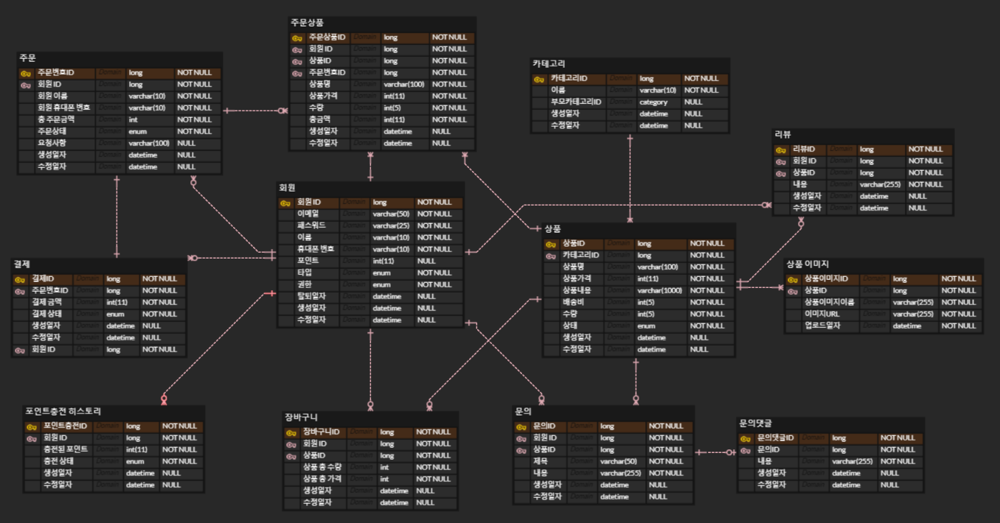

# SpringBoot-Project-ecommerce

## 🖥️ 프로젝트 소개
Spring Boot + JPA를 활용한 다양한 의류를 판매하는 B2C 방식 쇼핑몰 API 프로젝트입니다.  

 

## 📆 개발 기간
* 24.06.17 - 22.07.22

## ⚙️ 개발 환경
- **JAVA 17**
- **gradle 8.8**
- **Framework** : Spring Boot (3.3.0)
- **Database** : MySQL

## 📌 주요 기능

### 회원
- 계정
  - 이메일 회원
    - 회원가입 시 이메일, 닉네임, 패스워드, 휴대폰 번호을 입력하며 이메일은 Unique 해야한다.
    - 이메일 인증을 완료해야 서비스를 이용할 수 있다.
    - 이메일 인증 유효 시간은 5분이다.
  - 소셜 회원 (카카오)
    - 첫 로그인이면 회원가입이 이루어진다.
  - 로그인
    - 이메일 회원은 이메일과 비밀번호, 소셜 회원은 소셜 계정으로 로그인을 시도한다.
    - 이메일 중복 체크
  - 회원 정보 확인
    - 장바구니, 주문 내역, 주문 상세정보, 취소 내역, 리뷰 내역, 문의 내역 조회
  - 회원 정보 수정
    - 닉네임, 패스워드, 휴대폰 번호 변경할 수 있다.
  - 회원 탈퇴
    - 회원에 대한 정보 (장바구니, 주문 내역, 취소 내역, 리뷰 내역, 문의 내역) 삭제
    - DB에서 삭제되지 않고 삭제된 시간 저장
- 상품
  - 상품 조회 및 검색
    - 최신순 상품 조회
    - 카테고리별 상품 조회
    - 상품명 검색
  - 상품의 상세정보를 확인할 수 있다.
- 장바구니
  - 장바구니 추가
    - 상품 정보, 수량을 장바구니에 추가한다.
  - 장바구니 수정
    - 장바구니 내 상품의 수량을 수정할 수 있다.
    - 수량을 1개 이하로 설정할 수 없다.
  - 장바구니 삭제
    - 장바구니에 담긴 상품을 삭제할 수 있다.
  - 장바구니 조회
    - 장바구니에 담긴 상품을 조회할 수 있다.
- 주문
  - 주문하기
    - 상품 가격보다 포인트가 많을 시, 재고가 1개 이상일 때 주문이 가능하다.
  - 주문 수정
    - 주문한 상품의 수량을 수정할 수 있다.
    - 수량을 1개 이하로 설정할 수 없다.
  - 주문 취소
  - 주문 조회
    - 주문 내역, 상세정보를 조회할 수 있다.
- 상품 문의 및 리뷰
  - 상품별 리뷰 · 문의 등록, 수정, 삭제가 가능하다.
  - 회원이 작성한 리뷰, 문의 내역을 조회할 수 있다.
- 포인트 및 결제
  - 포인트 충전을 할 수 있다.
  - 포인트 충전 내역을 조회할 수 있다.
  - 결제 내역을 확인할 수 있다.
### 관리자
- 상품 관리
  - 상품 등록
    - 상품 이미지, 상품명, 카테고리, 가격, 수량, 설명, 택배비 등 작성한다.
    - 상품 이미지 1장 이상 필수로 등록해야 한다.
  - 상품 수정
    - 상품 이미지 1장 이상 필수로 등록해야 한다.
  - 상품 삭제
  - 등록된 상품 검색 및 조회
- 회원 관리
  - 회원 목록을 조회할 수 있다.
  - 회원에 대한 상세정보를 조회할 수 있다.
  - 회원 계정을 관리할 수 있다 (활성화, 비활성화)
- 주문 관리
  - 모든 주문을 조회할 수 있다.
  - 주문별 상세정보를 확인할 수 있다. (주문한 회원, 상품 정보, 주문 상태)
  - 주문 상태를 변경할 수 있다. (예 : 처리중, 배송중, 완료, 취소)
- 상품 문의 및 리뷰 관리
  - 상품별 리뷰, 문의에 대한 답변 작성이 가능하다.
  - 부적절한 리뷰, 문의 삭제가 가능하다.
- 카테고리 관리
  - 상품 카테고리 등록, 수정, 삭제가 가능하다 (부모 - 자식 관계 설정)
- 포인트 및 결제
  - 회원들의 포인트 충전 내역을 조회할 수 있다.
  - 회원들의 결제 내역을 조회할 수 있다.

### ✔ 추가할 기능
1. 주문 처리 실시간 알림, 문의 답변 실시간 알림 (kafka)
2. 실시간 상담 문의 (Spring Boot Web Socket)
3. 최근 본 상품 (Cookie or Session)

## ERD

## Trouble Shooting
[go to the trouble shooting section](TROUBLE_SHOOTING.md)

### Tech Stack

 
   
   
   
  
   
  
  
  

